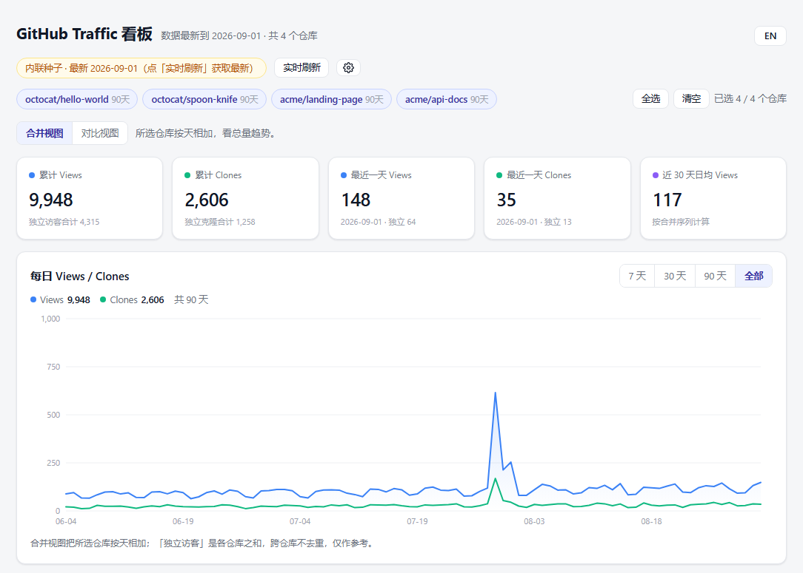
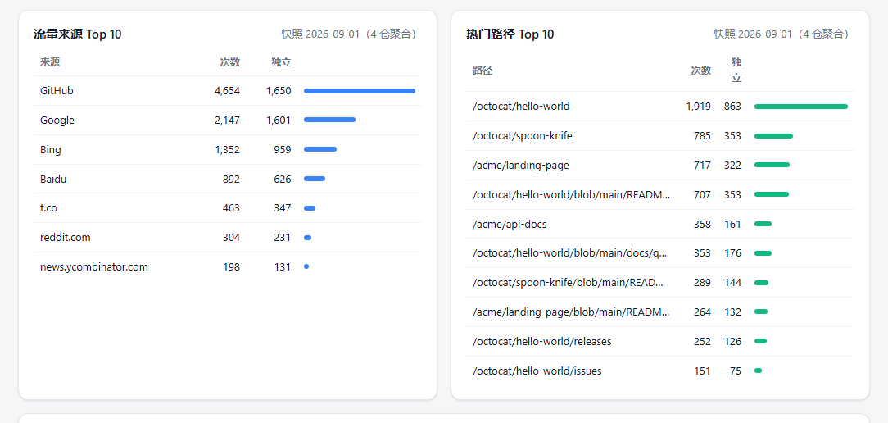
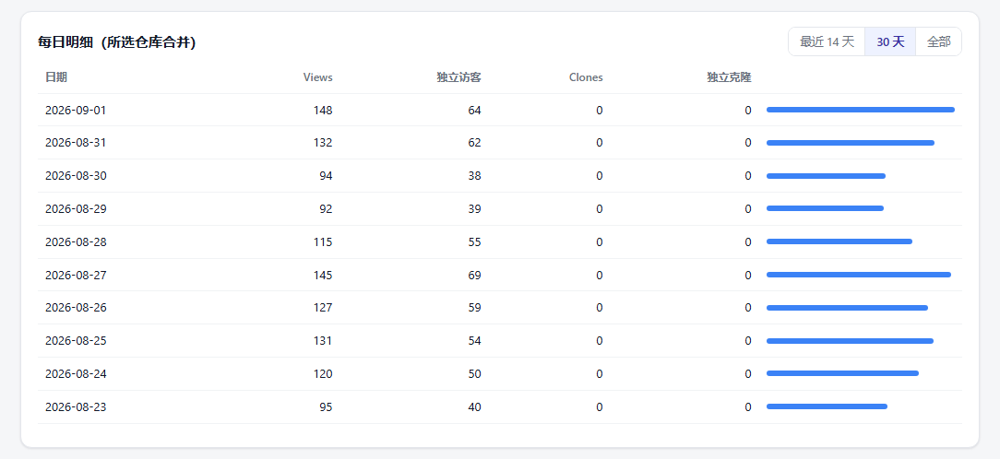
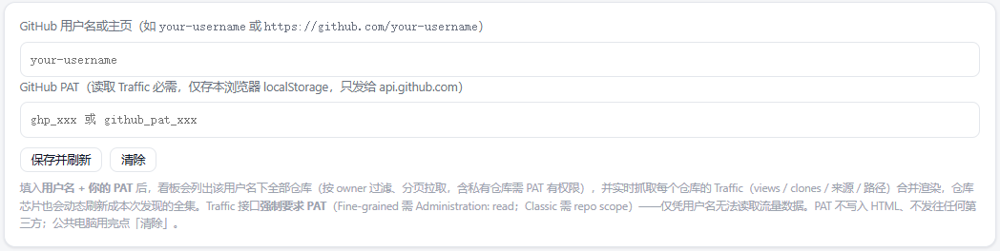

<!-- SPDX-License-Identifier: GPL-3.0-only -->
<!-- Copyright (c) 2026 fthuu -->

<div align="center">

# Gittrack · GitHub Traffic Dashboard

**[English](#english)** | **[中文](#中文)**

</div>

---

## English

# Gittrack · GitHub Traffic Dashboard

GitHub's web Traffic page only keeps the last **14 days**. Gittrack helps you **permanently accumulate** this data, generating a **single-file offline HTML dashboard** that you can open by double-clicking.

Zero dependencies (no CDN, no Chart.js), zero third-party accounts — data is inlined into the HTML, and it opens with a double-click via `file://`.

### 📸 Preview

| | |
|:---:|:---:|
|  |  |
| Main dashboard: status badges, repo chips, summary cards, Views/Clones dual line chart | Traffic Sources Top 10 + Popular Paths Top 10 |
|  |  |
| Daily detail table (supports 14 days / 30 days / all) | Live refresh panel: enter username + PAT, stored in browser localStorage |

###  Features

- ** Live Refresh**: Enter your username + PAT, click refresh to pull the latest 14 days on the spot. PAT is stored only in your browser.
- ** Automatic Daily Collection**: Use GitHub Actions to pull data once a day; history accumulates permanently in a private repo.
- ** Single-file Offline**: `traffic-dashboard.html` has inlined data and hand-written SVG — just double-click to open.
- ** Multi-repo Auto Discovery**: By default lists all repos under your account; you can also specify explicitly.
- ** Dual View Toggle / 🌐 Bilingual **, etc.

###  Usage

Two data collection methods — **use them together, not as an either/or**:

| | ① Live Refresh | ② Actions Auto Collection |
| --- | --- | --- |
| Who does it | Browser calls GitHub API | GitHub Actions runs on schedule |
| Can it persist? | ❌ Gone when the page closes | ✅ Permanently accumulated in private repo |
| What you need | A PAT | A private repo + a PAT |

> The data source is the GitHub Traffic API, which **only returns the last 14 days**. Live refresh is for immediate viewing;
> Actions deposits each day's window into a file — the only way to keep history without gaps.

#### ① Live Refresh (1 minute)

1. Open `traffic-dashboard.html` (it's blank the first time, which is normal).
2. Click the gear ⚙, enter your username and PAT (Classic: check `repo`; Fine-grained: grant `Administration: Read-only`).

   

3. Click "Live Refresh" → list repos → pull 14 days → render.

>  Under `file://` some browsers don't persist localStorage. If the refresh button is greyed out, use `python -m http.server` to start a local server and try again.

#### ② Actions Auto Collection (Recommended)

Deposit each day's window into a private repo so history accumulates across days without gaps. The script doesn't run persistently — it's checked out and run by GitHub Actions each time.

**A. Prepare the Private Data Repo**

1. Create a new **private** repo (data repo) to store accumulated history and generated dashboards.
2. Copy `.github/workflows/collect-traffic.yml.example` from this repo into it, and rename it to `.github/workflows/collect-traffic.yml`.
3. Edit the workflow and change `TOOL_REPO` to your **public tool repo** (`owner/repo`, e.g. `fthuu/Gittrack-github-traffic-dashboard`). Actions will check it out to `.tool/` and use the scripts inside.
4. Place a `config/repos.json` (copy the template and modify) to decide which repos to collect:
   - `"mode": "auto"`: Auto-discover all repos under your account (you can filter with `include_private` / `include_forks` / `include_archived` / `max_repos` / `include_patterns` / `exclude_patterns` in the `auto` block).
   - `"mode": "explicit"`: Only collect repos explicitly listed in the `repos` array (also suitable for repos authorized to you by others).
5. In the data repo, go to **Settings → Secrets and variables → Actions → New repository secret** and create `TRAFFIC_TOKEN` using a PAT that can read Traffic for the target repos (the Traffic API actually requires push-level permissions):
   - Classic PAT: check the `repo` scope.
   - Fine-grained PAT: `Permissions → Administration: Read-only`, and select authorization for the target repos under `Repository access`.

**B. Trigger & Verify**

6. Go to the data repo **Actions → Collect GitHub Traffic → Run workflow** and run it once manually for verification. You can expand the `workflow_dispatch` options:
   - `repos`: Only collect specified repos (`owner/repo,owner2/repo2`); leave empty to use `config/repos.json`.
   - `mode`: `auto` / `explicit`, overrides settings in `repos.json`.
   - `dry_run`: Only fetch and print, no file writes, no commits (for troubleshooting).
   - `skip_referrers`: Skip referrers / popular paths archiving.
7. After a successful run, the data repo will have an updated `data/traffic-history.json` and `dashboard.html`, auto-committed (skipped if data hasn't changed). Open `dashboard.html` to see accumulated history.

**C. Automatic Daily Runs Afterward**

After that, it runs automatically every day at **UTC 02:00 (Beijing time 10:00)** (cron `0 2 * * *`). **History starts from the day you first successfully collected** — there's no fixed starting point.
> ⚠️ GitHub doesn't guarantee exact timing; it may be delayed by tens of minutes during peak hours. Repos with **no commits for 60 days will have scheduled tasks disabled** — keep having traffic or manually trigger to prevent this.
> To backfill earlier history, you can use `seed_from_csv.py` to merge exported CSVs into `data/traffic-history.json` (see the script's `--help` for details).

#### How They Work Together

Badge states: grey (no credentials configured) / blue (inline seed, snapshot accumulated by Actions) / green (just live-refreshed).
Opening the dashboard shows Actions-accumulated history; clicking refresh merges the latest 14 days in (without duplicate counting).
Note: live-refreshed data only exists in memory and **is not written back to files** — to persist permanently, you must use Actions.

###  Bilingual Toggle

Click `EN` / `中文` in the upper right corner to switch languages; preference is stored in `localStorage`.

###  License

```
SPDX-License-Identifier: GPL-3.0-only
Copyright (c) 2026 fthuu
```

Licensed under GNU GPL v3.0 only — see [LICENSE](LICENSE).

###  Author

- Xiaohongshu / Rednote：@Epho
- GitHub：https://github.com/fthuu

---

## 中文

# Gittrack · GitHub Traffic 历史看板

GitHub 网页上的 Traffic 只保留最近 **14 天**。Gittrack 帮你把这段数据**永久累积**，生成一个可双击打开的**单文件离线 HTML 看板**。

零依赖（不引 CDN、不需要 Chart.js）、零第三方账号，数据内联进 HTML，`file://` 双击即开。

### 📸 预览

| | |
|:---:|:---:|
|  |  |
| 主看板：状态徽标、仓库芯片、汇总卡片、Views/Clones 双折线 | 流量来源 Top 10 + 热门路径 Top 10 |
|  |  |
| 每日明细表（支持 14 天 / 30 天 / 全部） | 实时刷新面板：填用户名 + PAT，存本浏览器 localStorage |

###  特性

- ** 实时刷新**：填用户名 + PAT，点刷新就地拉取最新 14 天，PAT 只存本浏览器。
- ** 自动每日采集**：用 GitHub Actions 每天拉一次，历史在私有仓库永久累积。
- ** 单文件离线**：`traffic-dashboard.html` 数据内联、手写 SVG，双击直开。
- ** 多仓库自动发现**：默认列出你名下所有仓库，也可显式指定。
- ** 双视图切换 / 🌐 中英文 ** 等。

###  使用方式

两种取数方式，**叠加使用，不是二选一**：

| | ① 实时刷新 | ② Actions 自动采集 |
| --- | --- | --- |
| 谁来做 | 浏览器调 GitHub API | GitHub Actions 每天定时跑 |
| 能留存吗 | ❌ 关页即失 | ✅ 永久累积到私有仓库 |
| 需要准备 | 一个 PAT | 一个私有仓库 + 一个 PAT |

> 数据源都是 GitHub Traffic API，它**只返回最近 14 天**。实时刷新看完就扔；
> Actions 把每天的窗口沉淀到文件，是唯一能让历史不断档的方式。

#### ① 实时刷新（1 分钟）

1. 打开 `traffic-dashboard.html`（首次空白，属正常）。
2. 点齿轮 ⚙，填用户名与 PAT（Classic 勾 `repo`；Fine-grained 给 `Administration: Read-only`）。

   

3. 点「实时刷新」→ 列出仓库 → 拉取 14 天 → 渲染。

>  `file://` 下部分浏览器不持久化 localStorage，刷新按钮灰了就用 `python -m http.server` 起服务再开。

#### ② Actions 自动采集（推荐）

把每日窗口沉淀到私有仓库，历史才能跨天累积、不断档。脚本不常驻，每次由 GitHub Actions 临时检出运行。

**A. 准备私有数据仓库**

1. 新建一个**私有**仓库（数据仓库），用来存放累积的历史与生成的个人看板。
2. 把本仓库的 `.github/workflows/collect-traffic.yml.example` 复制进去，改名为 `.github/workflows/collect-traffic.yml`。
3. 编辑该 workflow，把 `TOOL_REPO` 改成你的**公开工具仓库**（`owner/repo`，例如 `fthuu/Gittrack-github-traffic-dashboard`）。Actions 会把它检出到 `.tool/` 并使用里面的脚本。
4. 放一份 `config/repos.json`（复制模板再改），决定采集哪些仓库：
   - `"mode": "auto"`：自动发现你名下所有仓库（可在 `auto` 里用 `include_private` / `include_forks` / `include_archived` / `max_repos` / `include_patterns` / `exclude_patterns` 过滤）。
   - `"mode": "explicit"`：只采集 `repos` 数组里显式列出的仓库（也适合补充采集别人授权给你的仓库）。
5. 在数据仓库 **Settings → Secrets and variables → Actions → New repository secret** 新建 `TRAFFIC_TOKEN`，用能读取目标仓库 Traffic 的 PAT（Traffic API 实际要求 push 级权限，按下面选范围）：
   - Classic PAT：勾选 `repo` 范围。
   - Fine-grained PAT：`Permissions → Administration: Read-only`，并在 `Repository access` 选中对目标仓库的授权。

**B. 触发与验证**

6. 进入数据仓库 **Actions → Collect GitHub Traffic → Run workflow** 手动跑一次做验证。可展开 `workflow_dispatch` 选项：
   - `repos`：只采集指定仓库（`owner/repo,owner2/repo2`），留空则用 `config/repos.json`。
   - `mode`：`auto` / `explicit`，覆盖 `repos.json` 里的设置。
   - `dry_run`：只拉取并打印，不写文件、不提交（排查用）。
   - `skip_referrers`：跳过 referrers / popular paths 归档。
7. 跑成功后，数据仓库会多出 / 更新 `data/traffic-history.json` 和 `dashboard.html`，并自动提交（数据无变化则跳过提交）。打开 `dashboard.html` 即可看到累积的历史。

**C. 之后每天自动跑**

之后每天 **UTC 02:00（北京时间 10:00）** 自动执行（cron `0 2 * * *`）。**历史从你第一次成功采集那天开始**，无固定起点。
> ⚠️ GitHub 不保证准点，高峰期可能延迟数十分钟；仓库 **60 天无任何提交会停用定时任务**——保持有流量或有手动触发即可。
> 想回填更早的历史，可用 `seed_from_csv.py` 把导出的 CSV 合并进 `data/traffic-history.json`（详见脚本 `--help`）。

#### 两者怎么配合

徽标三态：灰（没配凭据）/ 蓝（内联种子，Actions 沉淀的快照）/ 绿（刚实时刷新过）。
打开看板看到的是 Actions 累积的历史；点刷新则把最新 14 天合并进来（不重复计算）。
注意：实时刷新的数据只在内存，**不会写回文件**，想永久留存只能靠 Actions。

###  中英文切换

点右上角 `EN` / `中文` 切换，偏好存 `localStorage`。


###  License

```
SPDX-License-Identifier: GPL-3.0-only
Copyright (c) 2026 fthuu
```

基于 GNU GPL v3.0 only 开源 — 见 [LICENSE](LICENSE)。

###  作者

- Xiaohongshu / Rednote：@Epho
- GitHub：https://github.com/fthuu
